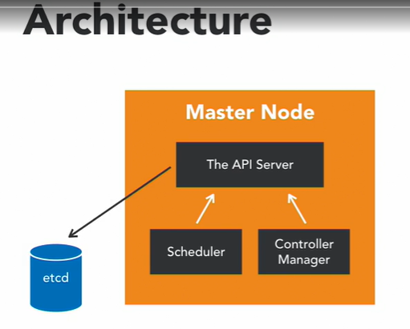
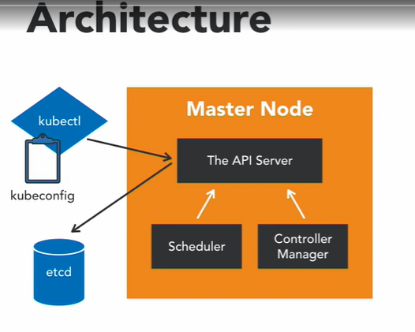
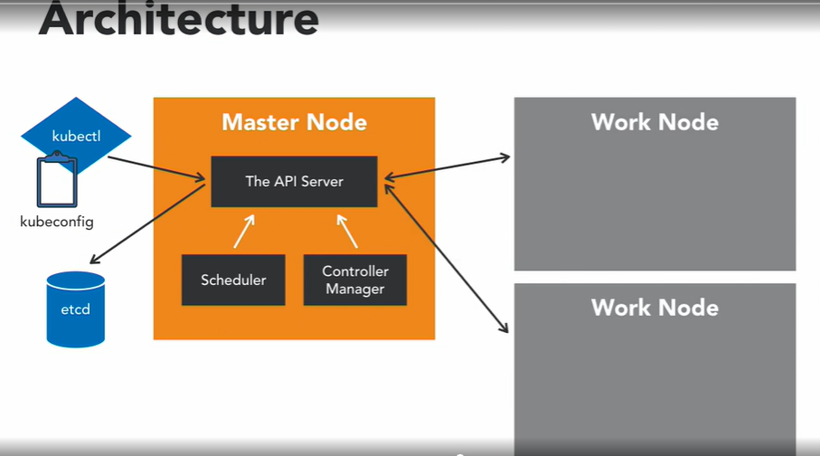
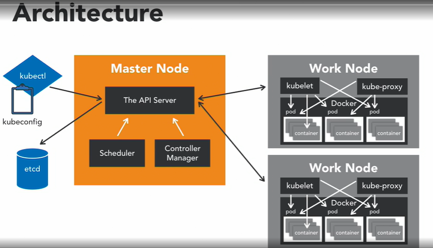
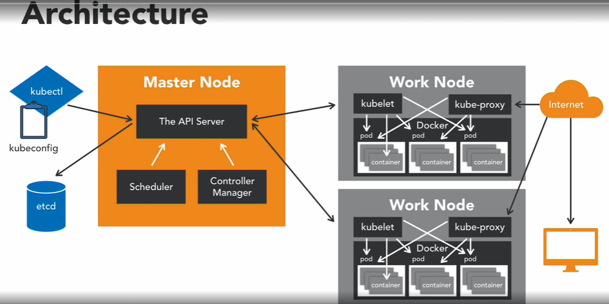

# Kubernetes-Intro

## Architecture of kubernetes cluster
<h2>Overview</h2>

<h2>Master Node</h2>

The <b>Master Node</b> is responsible for the overall management of the Kubernetes Cluster.  
Its got 3 components:
* <b>API Server</b>: allows to interact with the kubernetes API. It's a front-end of the kubernetes control plane.
* <b>Scheduler</b>: it watches created Pods, who do not have a Node design yet, and designs the Pod to run on a specific Node
* <b>Controller manager</b>: it run controllers. These are backgroung threads that run tasks in a cluster. The Controller actually has a bunch of different roles, but that's all compiled into a single binary. The roles include:
  - <b>Node Controllers</b> who is responsible for worker states.
  - <b>Replication Controllers</b> which is responsible for maintaining the correct number of Pods for the replicated controllers.
  - <b>End-Point Controllers</b> which joins services and pods together.
  - <b>Service account and Token Controllers</b> that handle access management.
  
<h2>etcd</h2>

The <b>etcd</b> is a simple distributed key value stored.  
Kubernetes uses etcd as its database and stores all cluster data here. Some of the information that might be stored, is:
* Job scheduling
* Pod details
* Stage information, etc..
	
<h2>kubectl</h2>

You interact with the master node using <b>kubectl</b> application which is the command line interface for kubernetes.  
Kubectl has a config file called <b>kubeconfig</b>. This file has a server information, as well as authentication information to access the API server.

<h2>Worker Node</h2>

<b>worker nodes</b> are the nodes where your application operate.  
The <b>worker nodes</b> communicate back with the Master node.

<h2>Worker Node Inside</h2>

* <b>Kubelet</b>
Communication to a Worker Node is handled by the Kubelet Process.   
It's an agent that communicates with the API Server to see if Pods have been designed to the Nodes.   
It executes Pod containers via the container engine.   
It mounts and runs Pod volume and secrets. And finally, is aware of Pod of Node states and responds back to the Master.   
It's safe to say that if the Kubelet isn't working correctly on the Worker Node, you're going to have issues.   
* <b>Docker</b>
Kubernetes is an container orchestrator, so the expectation is that you have a container native platform running on your Worker Nodes.   
This is where Docker comes in and works together with Kubelet to run containers on the Node.  
You could use alternate container platforms, as well, like mumbles ( https://wiki.mumble.info/wiki/Main_Page), but not a lot of folks do this anymore.  
* <b>Kube-proxy</b>
This process is the Network Proxy and load balancer for the service, on a single Worker Node.  
It handles the network routing for TCP and UDP Packets, and performs connection forwarding.   
* <b>Pod</b>
Having the Docker Demon allows you to run containers.   
Containers of an application are tightly coupled together in a Pod.   
By definition, a Pod is the smallest unit that can be scheduled as a deployment in Kubernetes. This group of containers share storage, Linux name space, IP addresses, amongst other things. They're also call located and share resources that are always scheduled together.   
Once Pods have been deployed, and are running, the Kubelet process communicates with the Pods to check on state and health, and the Kube-proxy routes any packets to the Pods from other resources that might be wanting to communicate with them  

<h2>Worker Node expose outside</h2>

Worker Nodes can be exposed to the <b>internet</b> via load balancer. And, traffic coming into the Nodes is also handled by the Kube-proxy, which is how an <b>End-user</b> ends up talking to a Kubernetes application.  

