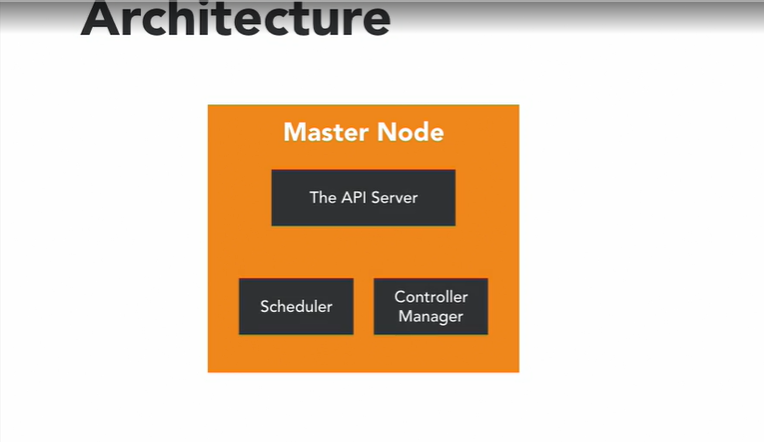

# Kubernetes-Intro
Leaning Kubernetes

## Architecture of kubernetes cluster
<h2>Overview</h2>

<h2>Master Node</h2>

The <b>Master Node</b> is responsible for the overall management of the Kubernetes Cluster.  
Its got 3 components:
* <b>API Server</b>: allows to interact with the kubernetes API. It's a front-end of the kubernetes control plane.
* <b>Scheduler</b>: it watches created Pods, who do not have a Node design yet, and designs the Pod to run on a specific Node
* <b>Controller manager</b>: it run controllers. These are backgroung threads thst run tasks in a cluster. The Controller actually has a bunch of different roles, but that's all compiled into a single binary. The roles include:
  - <b>Node Controllers</b> who is responsible for worker states.
  - <b>Replication Controllers</b> which is responsible for maintaining the correct number of Pods for the replicated controllers.
  - <b>End-Point Controllers</b> which joins services and pods together.
  - <b>Service account and Token Controllers</b> that handle access management.
